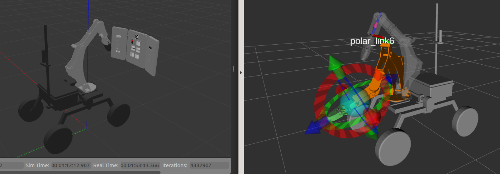
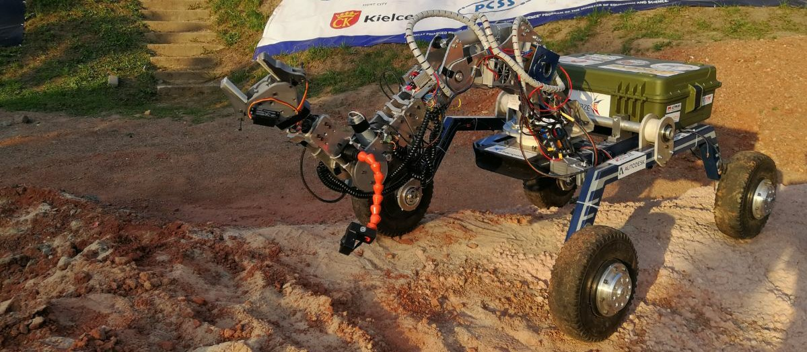

# ws_polar
Polar Robotic Arm control software built with MoveIt by [GTU Rover](https://rover.gtu.edu.tr). A 6-dof mobile manipulator designed for Mars missions. Includes a Gazebo simulation environment and hardware controllers to drive real robot. Competed in European Rover Challenge 2021.

**Update:** See [ws_polar2](../../../ws_polar2).



<p align="center">  </p>


### Installation
```bash
# Install
mkdir -p ws_polar/src
cd ws_polar/src
git clone <this_repo>
rosdep install -y --from-paths . --ignore-src --rosdistro melodic

# Build
cd ..
catkin build
source devel/setup.bash
```

### Run
Run simulation. 
```bash
roslaunch polar_simulation polar_simulation.launch
```

Bringup launcher for driving the real arm.
```bash
roslaunch polar_control polar_hw.launch
```

Launch joystick controller.
```bash
roslaunch jog_launch polar.launch use_joy:=true
```

### Debug/Modify
Modify MoveIt configuration.
```bash
roslaunch moveit_setup_assistant setup_assistant.launch 
``` 

Test configuration.
```bash
roslaunch polar_moveit_config demo.launch 
```

### Package Details
Commit history is clear, for more details recommended to follow them.
Physical joint limits(position, velocity, torque) needs to be measured after production and applied to arm description and configurations.

* **polar_description:** Description package of robot generated by Fusion2Urdf and modified by hand. 

  >   Before generating the URDF/Xacro, optimize the CAD drawing. 
  >   1. Combine each seperate link as one solid body. 
  >   2. Then simplify. Delete unnecessary faces like fillets, gear teeth, inner spaces and objects like bolts, nuts, anything smaller than 5cm. 
  >
  >   No need for mechanical components, complex faces in mesh to calculate collisions. It will take too much computation. 

* **polar_moveit_config:** MoveIt config(joint limits, joint names, and kinematic properties) and launch(robot description, planning scene, motion planner, and trajectory executor) files. 

* **polar_simulation:** Setups the simulation world. Launches Gazebo from polar_gazebo, MoveGroup, Rviz and spawns the panel.

* **polar_control:** Derives from ros_control_boilerplate. Sending commands to embedded system via serial communication. And listening back for encoder feedback. 


---


#### Resources
* https://github.com/erdalpekel/panda_simulation
* https://erdalpekel.de/
* https://github.com/sgzuccaro/moveit_tutorials
* https://github.com/nasa-jpl/osr-rover-code/blob/master/ROS/osr/src/roboclaw.py
* http://wiki.ros.org/ros_control 
* http://wiki.ros.org/rosbridge_suite 
* http://wiki.ros.org/urdf/XML 

#### Tools
* https://github.com/syuntoku14/fusion2urdf
* https://www.meshlab.net/
* https://www.blender.org/ 
* https://marketplace.visualstudio.com/items?itemName=smilerobotics.urdf
